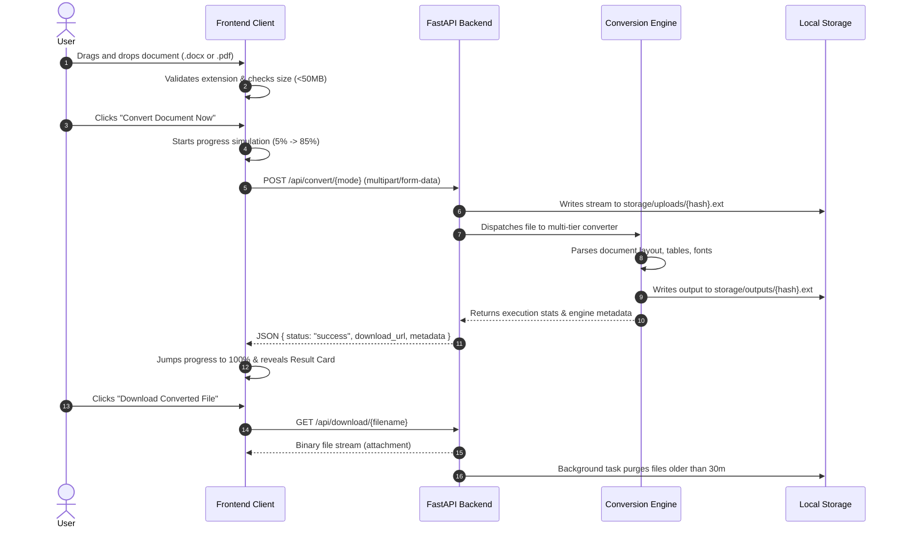

# 🏛️ DocuMorph System Architecture & Specifications

This document outlines the overarching system architecture, request lifecycle, data privacy boundary, and engineering principles behind DocuMorph.

---

## 1. System Topology

DocuMorph is designed as a modular decoupled system featuring a rich browser client, an asynchronous FastAPI application server, and isolated multi-tier conversion engines.

```mermaid
graph LR
    subgraph Client [Browser Client (Frontend)]
        UI[Glassmorphic UI]
        DND[Drag & Drop Controller]
        State[Mode & Progress State]
    end

    subgraph Server [DocuMorph Server]
        API[FastAPI Gateway]
        Storage[(Temporary Storage / Isolation)]
        Worker[Background Cleanup Worker]
    end

    subgraph Engines [Conversion Engines]
        W2P_Tier1[docx2pdf - MS Word COM]
        W2P_Tier2[LibreOffice Headless]
        W2P_Tier3[ReportLab Pure Python]
        P2W_Tier1[pdf2docx AI Layout]
        P2W_Tier2[PyPDF Stream Extractor]
    end

    UI --> DND
    DND --> State
    State -->|HTTP Multipart POST| API
    API --> Storage
    API --> W2P_Tier1 & W2P_Tier2 & W2P_Tier3
    API --> P2W_Tier1 & P2W_Tier2
    API -.-> Worker
```

---

## 2. End-to-End Request Lifecycle

The diagram below illustrates the exact sequence when a user drops a document:



---

## 3. Privacy & Security Guarantees

1. **Zero External Cloud Egress**:
   - Conversions execute 100% on the local host instance.
   - Files are never sent to third-party APIs, SaaS processors, or external telemetry hubs.
2. **Deterministic Cryptographic Naming**:
   - Files are saved as `<original_name>_<10_char_uuid>.<ext>`.
   - Prevents directory traversal attacks and namespace conflicts.
3. **Automated Ephemeral Retention**:
   - Files are considered ephemeral scratch data.
   - The background garbage collector unlinks temporary upload and output artifacts automatically after 30 minutes.

---

## 4. Scalability & Containerization Roadmap

- **Docker Support**: Can be packaged with a lightweight Linux base image (`python:3.11-slim` or `python:3.12-slim`) with `libreoffice-nogpu` pre-installed for Linux production servers.
- **Worker Scaling**: For high-volume enterprise workloads, the converter engine can be decoupled using Celery or Redis Queue (RQ) with multiple worker pools.
