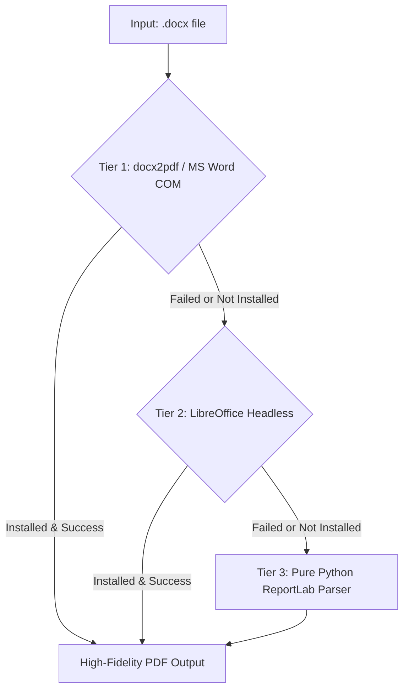

# ⚙️ DocuMorph Backend Documentation

This document provides a technical guide to the DocuMorph backend microservice, built with **FastAPI**, **python-docx**, **pdf2docx**, **ReportLab**, and **PyPDF**.

---

## 1. Backend Architecture

The backend operates as an asynchronous RESTful microservice providing conversion, file streaming, session isolation, and scheduled memory cleanup.

```
backend/
├── app.py                # FastAPI endpoints, middleware, routing, and lifecycle hooks
├── utils.py              # File validation, UUID session naming, storage auto-purging
└── converters/
    ├── __init__.py       # Converter exports
    ├── word_to_pdf.py    # Multi-tier DOCX -> PDF pipeline
    └── pdf_to_word.py    # Multi-tier PDF -> DOCX pipeline
```

---

## 2. Multi-Tier Conversion Pipeline

To ensure 100% conversion reliability regardless of the host environment, DocuMorph uses a multi-tier fallback architecture:

### 2.1. Word (.docx) to PDF Engine (`word_to_pdf.py`)



1. **Tier 1 - MS Word COM Automation (`docx2pdf`)**:
   - Uses Microsoft Word's native COM object on Windows (`Word.Application`).
   - Produces pixel-perfect PDF reproductions of fonts, page breaks, watermarks, and embedded vectors.
2. **Tier 2 - LibreOffice Headless**:
   - Invokes `soffice --headless --convert-to pdf` if available in system PATH.
   - Ideal for Linux docker containers and headless servers.
3. **Tier 3 - Pure Python ReportLab Engine (`python-docx` + `ReportLab`)**:
   - Parses document paragraphs, titles, headings, and tables into ReportLab `Flowables`.
   - Guarantees successful generation even on bare-metal systems with zero external office suites.

### 2.2. PDF to Word (.docx) Engine (`pdf_to_word.py`)

1. **Tier 1 - `pdf2docx` Vector & Layout Parser**:
   - Leverages PyMuPDF (`fitz`) and OpenCV to detect shapes, borders, fonts, and text blocks.
   - Reconstructs authentic Microsoft Word tables (`docx.table`) and paragraph styles instead of raw unstyled text.
2. **Tier 2 - `pypdf` Stream Fallback**:
   - Used when binary streams are encrypted or malformed.
   - Extracts page-by-page text blocks and formats them into a clean `.docx` file with structured page breaks.

---

## 3. REST API Endpoint Reference

### 3.1. Health Check
* **Endpoint:** `GET /api/health`
* **Description:** Diagnostic monitor checking operational readiness and conversion capabilities.
* **Sample Response:**
```json
{
  "status": "healthy",
  "service": "DocuMorph Converter",
  "version": "1.0.0",
  "capabilities": {
    "word_to_pdf": true,
    "pdf_to_word": true,
    "batch_conversion": true
  }
}
```

---

### 3.2. Convert Word to PDF
* **Endpoint:** `POST /api/convert/word-to-pdf`
* **Content-Type:** `multipart/form-data`
* **Form Field:** `file` (Binary file: `.docx` or `.doc`)
* **Sample Response (HTTP 200):**
```json
{
  "status": "success",
  "session_id": "a1b2c3d4e5",
  "original_filename": "Quarterly_Report.docx",
  "output_filename": "Quarterly_Report_a1b2c3d4e5.pdf",
  "download_url": "/api/download/Quarterly_Report_a1b2c3d4e5.pdf",
  "engine": "ms-word-com",
  "original_size": "245.8 KB",
  "converted_size": "180.2 KB",
  "warnings": null
}
```

---

### 3.3. Convert PDF to Word
* **Endpoint:** `POST /api/convert/pdf-to-word`
* **Content-Type:** `multipart/form-data`
* **Form Field:** `file` (Binary file: `.pdf`)
* **Sample Response (HTTP 200):**
```json
{
  "status": "success",
  "session_id": "f6g7h8i9j0",
  "original_filename": "Invoice_394.pdf",
  "output_filename": "Invoice_394_f6g7h8i9j0.docx",
  "download_url": "/api/download/Invoice_394_f6g7h8i9j0.docx",
  "engine": "pdf2docx-ai-layout",
  "original_size": "1.1 MB",
  "converted_size": "850.4 KB",
  "warnings": null
}
```

---

### 3.4. Secure File Download
* **Endpoint:** `GET /api/download/{filename}`
* **Response:** File stream with `Content-Disposition: attachment` header.
* **MIME Types:**
  * PDF: `application/pdf`
  * Word: `application/vnd.openxmlformats-officedocument.wordprocessingml.document`

---

## 4. Storage & Privacy Architecture

- **Session Isolation**: Every upload and output receives a unique 10-character cryptographically secure UUID suffix, preventing file overwrites and collision attacks.
- **Auto-Purge Background Task**:
  - The `cleanup_stale_files(max_age_seconds=1800)` utility runs on server startup and asynchronously after each conversion.
  - Any file in `storage/uploads/` or `storage/outputs/` older than 30 minutes is automatically deleted from disk.

---

## 5. Running the Backend Directly

To run the backend server standalone using Uvicorn:

```bash
# From the project root
.\.venv\Scripts\python.exe -m uvicorn backend.app:app --host 127.0.0.1 --port 8000 --reload
```

Interactive OpenAPI Swagger UI is available at: `http://127.0.0.1:8000/docs`
