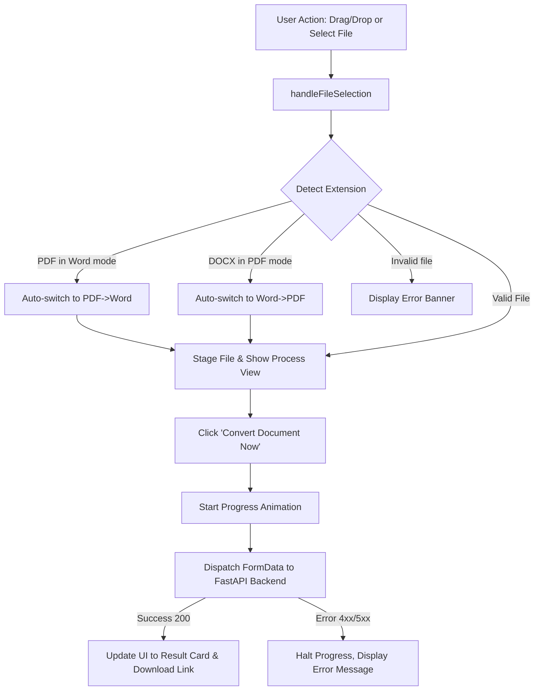

# 🎨 DocuMorph Frontend Documentation

This document provides a comprehensive technical breakdown of the DocuMorph frontend, covering design architecture, design tokens, HTML component structure, CSS glassmorphism implementation, and JavaScript state management.

---

## 1. Frontend Architecture & Design Philosophy

The DocuMorph client is built as a **zero-dependency, high-performance single-page application (SPA)** adhering to modern web design standards:
- **No Heavy Framework Overhead**: Built with semantic HTML5, Vanilla CSS3, and modern ECMAScript to achieve sub-millisecond initial paint times.
- **Glassmorphic Aesthetic**: Frosted glass cards (`backdrop-filter: blur(20px)`), vibrant ambient radial glows, and curated color palettes.
- **Bi-directional Flow**: Seamless transition between Word ➔ PDF and PDF ➔ Word with auto-detection.
- **Micro-Animations & Feedback**: Hover transitions, pulsing drop targets, dynamic progress indicators, and interactive copy notifications.

```
frontend/
├── index.html       # Semantic HTML5 layout, ARIA attributes, modals
├── css/
│   └── style.css    # Curated design tokens, themes (dark/light), responsive grid
└── js/
    └── app.js       # Drag & drop state machine, conversion controller, theme switcher
```

---

## 2. Design Tokens & Color Palette

All styling utilizes CSS Custom Properties declared on `:root` and scoped under `body.theme-light` for dynamic runtime theme switching without re-rendering:

| Token Name | Dark Mode (Default) | Light Mode | Purpose |
| :--- | :--- | :--- | :--- |
| `--bg-primary` | `#0a0f1d` (Deep Slate) | `#f8fafc` (Off White) | Main viewport backdrop |
| `--bg-secondary`| `#111827` (Charcoal) | `#ffffff` (Pure White) | Header, modal cards |
| `--bg-card` | `rgba(17, 24, 39, 0.75)` | `rgba(255, 255, 255, 0.85)` | Glassmorphic cards |
| `--border-color`| `rgba(255, 255, 255, 0.08)` | `rgba(0, 0, 0, 0.08)` | Subtle border rings |
| `--border-glow` | `rgba(99, 102, 241, 0.4)` | `rgba(99, 102, 241, 0.3)` | Card hover glow highlight |
| `--accent-indigo` | `#6366f1` | `#6366f1` | Primary CTA, focus states |
| `--accent-cyan` | `#06b6d4` | `#06b6d4` | Secondary accents, progress |
| `--accent-emerald`| `#10b981` | `#10b981` | Success badges, online indicators |
| `--accent-rose` | `#f43f5e` | `#f43f5e` | Error states, cancel actions |

---

## 3. Component Breakdown

### 3.1. Sticky App Header (`.app-header`)
- **Logo & Badge**: Brand icon with dynamic SVG glyph, gradient text (`DocuMorph`), and version pill.
- **AI Prompts Trigger (`#btnOpenPrompts`)**: Opens the modal library containing curated AI prompts.
- **Theme Switcher (`#themeToggleBtn`)**: Toggles `.theme-light` on `document.body` and stores preference in `localStorage`.

### 3.2. Conversion Mode Switcher (`.mode-tabs`)
- Utilizes standard ARIA tab attributes (`role="tablist"`, `role="tab"`, `aria-selected="true/false"`).
- Two dedicated conversion pathways:
  1. **Word to PDF** (`#modeWordToPdf`): Filters accept to `.docx, .doc`.
  2. **PDF to Word** (`#modePdfToWord`): Filters accept to `.pdf`.
- Supports **automatic format sniffing**: If a user is on "Word to PDF" mode but drops a `.pdf`, the client automatically switches tabs smoothly.

### 3.3. Converter Drop Zone (`#dropZone`)
- **Idle State**: Displays animated upload icon, instructions, "Browse Files" button, and security metadata chips.
- **Dragover State**: Emits high-contrast cyan border highlights and a gentle scale transform (`scale(1.008)`).
- **Processing State (`#processView`)**:
  - Selected file metadata chip with icon, filename, size, and direction badge.
  - Cancel button (`#btnCancelFile`) to unstage current file.
  - Multi-stage animated progress bar (`#progressBarFill`) with simulated progression phases:
    1. `5% - 25%`: Uploading document stream.
    2. `25% - 60%`: Parsing document layout, fonts, and styles.
    3. `60% - 85%`: Reconstructing tables and vector pages.
    4. `100%`: Finalizing and ready for download.

### 3.4. Conversion Result Card (`#resultBox`)
- Triggered once the backend returns HTTP 200.
- Shows:
  - Output filename.
  - Engine used (e.g., `Native Word COM Engine` or `pdf2docx Layout Reconstructor`).
  - Resulting file size.
  - Primary CTA: **Download Converted File** (`#btnDownload`).
  - Secondary CTA: **Convert Another File** (`#btnResetConverter`).

### 3.5. AI Prompt Hub Modal (`#promptsModal`)
- Frosted glass backdrop overlay (`backdrop-filter: blur(8px)`).
- Provides pre-written prompts for document typography, OCR cleaning, and batch conversion code.
- Includes one-click **Copy to Clipboard** with visual feedback (`Copied!`).

---

## 4. Frontend JavaScript Event Flow



---

## 5. Accessibility & SEO Compliance

- **Semantic Headings**: Strict hierarchy with a single `<h1>` for primary page indexing.
- **Unique Identifiers**: All interactive elements have descriptive IDs (`fileInput`, `btnStartConvert`, `themeToggleBtn`, etc.) for seamless browser automation and accessibility testing.
- **Keyboard Friendly**: Tab indices, explicit button types, and keyboard escape support for modals.
